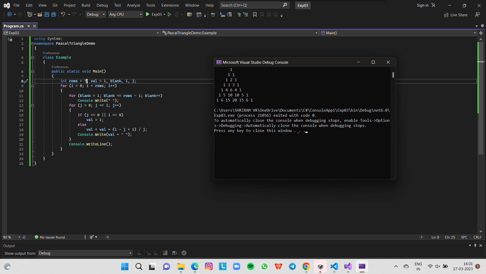

# Pattern

## Aim:
To write a C# program to print the pascal triangle

## Algorithm:

### Step1:
Start

### Step2:
Declare variables rows,val,i,j,blank

### Step3:
Initialize the value of variables, i=0,j=0,val=1

### Step4:
Enter the limit

### Step5:
using for loop printing " " when i&j==0 and using for loop applying the concept of pascal triangle

## Program:
Developed by: Shriramm R

Regiester No:  212221240053

~~~
using System;
namespace PascalTriangleDemo
{
    class Example
    {
        public static void Main()
        {
            int rows = 7, val = 1, blank, i, j;
            for (i = 0; i < rows; i++)
            {
                for (blank = 1; blank <= rows - i; blank++)
                    Console.Write(" ");
                for (j = 0; j <= i; j++)
                {
                    if (j == 0 || i == 0)
                        val = 1;
                    else
                        val = val * (i - j + 1) / j;
                    Console.Write(val + " ");
                }
                Console.WriteLine();
            }
        }
    }
}
~~~

## Output:

## Result:
Thus the C# program to display pascal triangle is exucuted sucessfully.